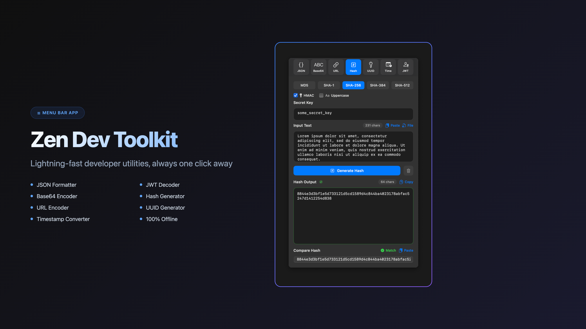

# ZenDevToolkit



<p align="center">
  
  
  
</p>

A lightweight macOS menu bar application that provides developers with quick access to commonly-needed utility functions without opening a web browser.

<p align="center">
  <a href="https://apps.apple.com/app/zen-dev-toolkit/id6750487692">
    
  </a>
</p>


## 🚀 Features

### Available Tools

- **JSON Formatter & Validator**
  - Format/beautify JSON with proper indentation
  - Minify JSON (remove whitespace)
  - Validate JSON syntax with clear error messages
  - Real-time validation as you type
  - File upload support for JSON files
  - Copy/paste integration with system clipboard
  - Keyboard shortcuts (⌘+Return to format)
  - **NEW: JSONPath Query Support**
    - Query JSON data using JSONPath expressions
    - Support for property access, array operations, wildcards
    - Recursive descent for nested searches
    - Basic filter expressions for conditional selection
    - Quick-access examples for common patterns

- **Base64 Encoder/Decoder**
  - Encode text to Base64 format
  - Decode Base64 strings to readable text
  - Bidirectional conversion with validation
  - Copy/paste integration

- **URL Encoder/Decoder**
  - Encode URLs with proper percent-encoding
  - Decode URL-encoded strings
  - Handle special characters and query parameters
  - Support for complex URL structures

- **Hash Generator**
  - Generate MD5, SHA1, SHA256 hashes
  - Support for text input with real-time generation
  - One-click copy to clipboard for each hash type
  - Multiple hash algorithms simultaneously

- **UUID Generator**
  - Generate Version 4 UUIDs instantly
  - Multiple format options (with/without hyphens, uppercase/lowercase)
  - Bulk generation with customizable count
  - Quick copy individual or all UUIDs

- **JWT Token Tool**
  - Decode JWT tokens to view header, payload, and signature
  - Generate new JWT tokens with custom claims
  - Verify JWT signatures with secret keys
  - Support for HS256, HS384, HS512 algorithms
  - Human-readable claims display with expiration tracking
  - JSON view for raw payload data
  - Copy individual sections or entire tokens

### Upcoming Features
- **Regex Tester & Matcher**
- **Color Converter** (hex, RGB, HSL)
- **QR Code Generator**

## 📋 Requirements

- **macOS**: 15.0 (Sequoia) or later
- **Xcode**: 15.0 or later
- **Swift**: 5.9 or later

## 🛠️ Installation

### Via Homebrew (Recommended)

#### One-Line Installation
```bash
brew install --cask dilee/tap/zen-dev-toolkit
```

#### Updating to Latest Version
```bash
brew update && brew upgrade --cask zen-dev-toolkit
```

#### Alternative: Tap First Method
```bash
# If you prefer to tap the repository first
brew tap dilee/tap
brew install --cask zen-dev-toolkit
```

### Direct Download

1. Download the latest release from the [Releases page](https://github.com/dilee/zen-dev-toolkit/releases)
2. Unzip the downloaded file
3. Move `ZenDevToolkit.app` to your Applications folder
4. **First launch**: Just double-click to open (fully signed and notarized)

### Mac App Store

[](https://apps.apple.com/app/zen-dev-toolkit/id6750487692)

Get ZenDevToolkit directly from the Mac App Store for automatic updates and seamless installation.

### Building from Source

1. Clone the repository:
   ```bash
   git clone https://github.com/dilee/zen-dev-toolkit.git
   cd zen-dev-toolkit
   ```

2. Open the project in Xcode:
   ```bash
   open ZenDevToolkit.xcodeproj
   ```

3. Build and run:
   - Select your Mac as the build target
   - Press ⌘+R or click the Run button in Xcode
   - The app will appear in your menu bar

## 💻 Usage

1. **Launch the app**: Look for the toolbox icon (📦) in your menu bar
2. **Open tools**: Left-click the menu bar icon to open the tool popover
3. **Switch tools**: Use the segmented control at the top to switch between utilities
4. **Access menu**: Right-click the menu bar icon for About and Quit options

### Keyboard Shortcuts
- **⌘+C**: Copy selected text
- **⌘+V**: Paste from clipboard
- **⌘+A**: Select all text
- **⌘+Return**: Format JSON (in JSON tool)
- **Click outside**: Close the popover

## 🎨 Features

- **Modern UI**: Clean, minimal design that adapts to macOS light/dark mode
- **Resizable Window**: Adjust the popover size (320×400 to 600×800)
- **Fast & Lightweight**: Native SwiftUI app with instant response times
- **Privacy-Focused**: All processing happens locally, no data sent to servers
- **Pure Menu Bar App**: Runs exclusively in menu bar, won't appear in Dock for clean desktop experience

## 🤝 Contributing

Contributions are welcome! Please feel free to submit a Pull Request. For major changes, please open an issue first to discuss what you would like to change.

1. Fork the repository
2. Create your feature branch (`git checkout -b feature/AmazingFeature`)
3. Commit your changes (`git commit -m 'Add some AmazingFeature'`)
4. Push to the branch (`git push origin feature/AmazingFeature`)
5. Open a Pull Request

## 🧪 Testing

Run tests in Xcode:
- **Unit Tests**: ⌘+U
- **UI Tests**: Select `ZenDevToolkitUITests` scheme and run

## 🔧 Troubleshooting

### Homebrew Installation Issues

**Getting an old version?**
```bash
# Force update the tap
brew update --force
brew upgrade --cask zen-dev-toolkit
```

**Want to check installed version?**
```bash
brew list --cask --versions zen-dev-toolkit
```

**Complete reinstall:**
```bash
brew uninstall --cask zen-dev-toolkit
brew install --cask dilee/tap/zen-dev-toolkit
```

### App Won't Open?
- **macOS 15.0+ required**: Check your macOS version in Apple Menu > About This Mac
- **Security warning**: Should not appear (app is fully signed and notarized)
- **Menu bar full**: Look for the 📦 icon, might be hidden in overflow menu

## 📝 License

This project is licensed under the MIT License - see the [LICENSE](LICENSE) file for details.

## 👤 Author

**Dileesha Rajapakse**
- GitHub: [@dilee](https://github.com/dilee)

## Support

If you find this useful, you can [buy me a coffee ☕ on Ko-fi](https://ko-fi.com/dilee).

## Acknowledgments

- Built with SwiftUI and love for the developer community
- Inspired by the need for quick, offline developer utilities
- Special thanks to all contributors and testers

## 📮 Support

If you encounter any issues or have feature requests, please [open an issue](https://github.com/dilee/zen-dev-toolkit/issues).

---
Made with ❤️ for developers who value productivity and simplicity
